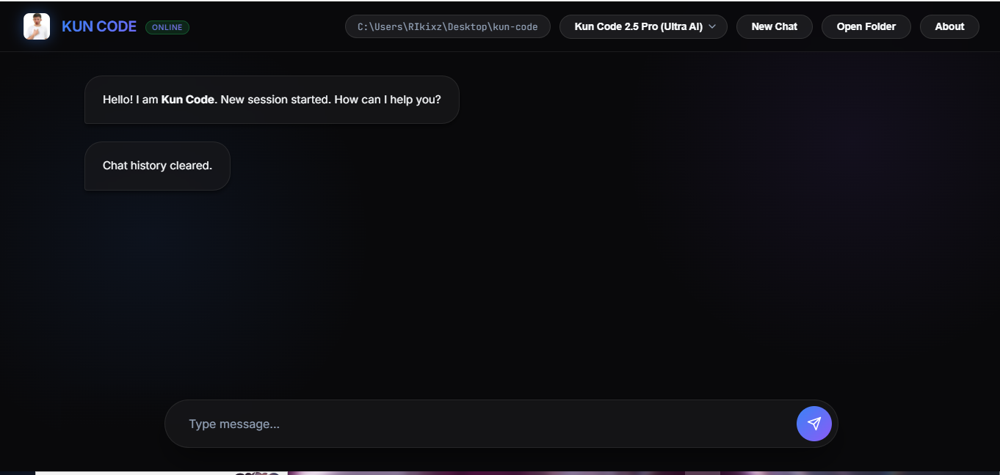
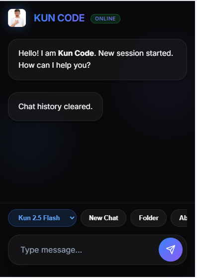
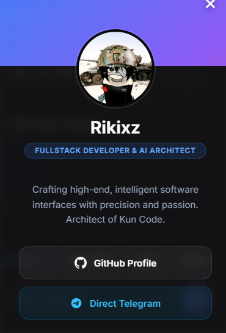

<div align="center">
  
  <h1>KUN CODE</h1>
  <p><strong>The Ultimate AI Developer IDE for Mobile & Desktop</strong></p>
</div>

<br />

<div align="center">
  
</div>

<br />

## 🌟 Overview

**Kun Code** is a high-end, premium web-based Integrated Development Environment (IDE) tightly integrated with Google's latest **Gemini 2.5 API**. Designed with a breathtaking dark-mode interface ("Zinc 950") and fluid glassmorphic elements, it empowers developers to write, test, and manage entire projects effortlessly—whether on a massive 4k desktop monitor or a smartphone.

Leveraging agentic AI capabilities, Kun Code doesn't just chat; it *runs commands*, *creates workflows*, and *engineers complete files* locally on your machine.

---

## ✨ Features

- 🌌 **Premium "Pro" UI/UX**: Deep dark mode, neon gradients, and frosted glass components designed for visual excellence.
- 🤖 **Gemini 2.5 Integration**: Uses the absolute latest Google AI models (Gemini 2.5 Pro, 2.5 Flash, 1.5 Pro).
- 📱 **Mobile-First Engine**: A dedicated, floating "Action Suite" on mobile browsers for seamless coding and model-switching on the go.
- ⚡ **Agentic Local Execution**: The AI has the power to run terminal commands, scan directories, and read or write files directly on your machine.
- 🛡️ **Workspace Control**: Dynamically switch workspaces and project directories within the IDE.
- 💳 **Modern Developer Card**: Includes a beautiful animated "About" card featuring developer links and credits.

---

## 📸 Screenshots

<div align="center">
  <table>
    <tr>
      <td align="center"><b>Mobile View</b></td>
      <td align="center"><b>About Developer Modal</b></td>
    </tr>
    <tr>
      <td></td>
      <td></td>
    </tr>
  </table>
</div>

---

## 🛠️ Setup & Installation

### Prerequisites
- **Python 3.10+**
- A valid **Gemini API Key** from [Google AI Studio](https://aistudio.google.com/)

### Instructions

1. **Clone the repository:**
   ```bash
   git clone https://github.com/blaxkmiradev/KUN-CODE.git
   cd KUN-CODE
   ```

2. **Install necessary dependencies:**
   ```bash
   pip install flask google-generativeai python-dotenv
   ```

3. **Start the application:**
   ```bash
   python app.py
   ```

4. **Access the IDE:**
   Open your browser and navigate to `http://127.0.0.1:5000`. 
   Upon first launch, the app will prompt you for your Gemini API key, safely storing it locally in a `.env` file!

---

## 🧑‍💻 Architect & Developer

**Rikixz**  
*Fullstack Developer & AI Architect*

[](https://github.com/blaxkmiradev)
[](https://t.me/yunaonthetp)

---

<div align="center">
  <p><i>Crafting high-end, intelligent software interfaces with precision and passion.</i></p>
  <b>Designed & Built with 💙 by Rikixz</b>
</div>
